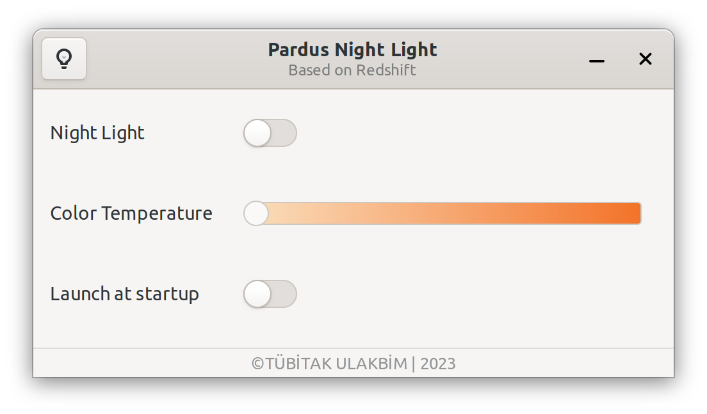

# Pardus Night Light

Pardus Night Light adjusts the color temperature of your screen to reduce eye strain at night.

The app automatically selects the appropriate backend for your desktop environment:
- **GNOME / Unity / Budgie** — GSettings (`org.gnome.settings-daemon.plugins.color`)
- **KDE / Plasma** — D-Bus (`org.kde.kwin.ColorCorrect`)
- **Wayland** (when neither of the above matched) — gammastep
- **Fallback** — redshift

[](https://repology.org/project/pardus-night-light/versions)

### **Dependencies**

This application is developed based on Python3 and GTK+ 3. Dependencies:
```bash
gir1.2-ayatanaappindicator3-0.1 gir1.2-glib-2.0 gir1.2-gtk-3.0 redshift
```

### **Run Application from Source**

Install dependencies
```bash
sudo apt install gir1.2-ayatanaappindicator3-0.1 gir1.2-glib-2.0 gir1.2-gtk-3.0 redshift
```

Clone the repository
```bash
git clone https://github.com/pardus/pardus-night-light.git ~/pardus-night-light
```

Run application
```bash
python3 ~/pardus-night-light/src/Main.py
```

### **Build deb package**

```bash
sudo apt install devscripts git-buildpackage
sudo mk-build-deps -ir
gbp buildpackage --git-export-dir=/tmp/build/pardus-night-light -us -uc
```

### **Screenshots**


