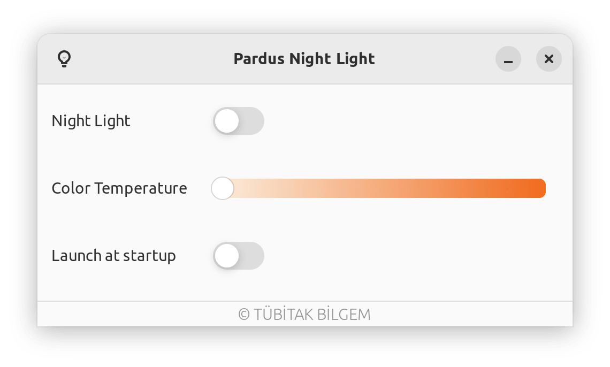

# Pardus Night Light

Pardus Night Light is a night light application based on redshift.

Redshift adjusts the color temperature of your screen according to your surroundings.This may help your eyes hurt less if you are working in front of the screen at night.

[](https://repology.org/project/pardus-night-light/versions)

### **Dependencies**

This application is developed based on Python3 and GTK+ 3. Dependencies:
```bash
gir1.2-ayatanaappindicator3-0.1 gir1.2-glib-2.0 gir1.2-gtk-3.0 redshift
```

### **Run Application from Source**

Install dependencies
```bash
sudo apt install gir1.2-ayatanaappindicator3-0.1 gir1.2-glib-2.0 gir1.2-gtk-3.0 redshift
```

Clone the repository
```bash
git clone https://github.com/pardus/pardus-night-light.git ~/pardus-night-light
```

Run application
```bash
python3 ~/pardus-night-light/src/Main.py
```

### **Build deb package**

```bash
sudo apt install devscripts git-buildpackage
sudo mk-build-deps -ir
gbp buildpackage --git-export-dir=/tmp/build/pardus-night-light -us -uc
```

### **Screenshots**


